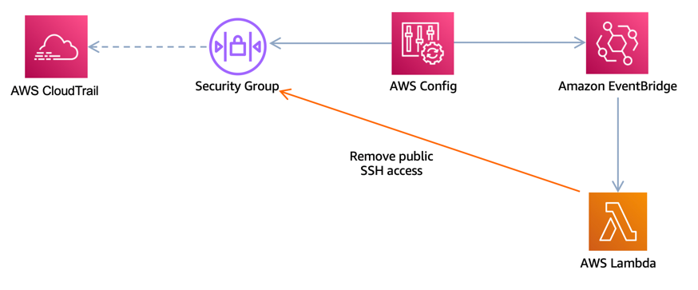

# Welcome to SSH-Auto-Restricted 

## SSH-Auto-Restricted deploys an SSH compliance rule with auto-remediation via AWS Lmabda if SSH access is public.


* SSH-Auto-Restricted checks incoming SSH traffic configurations for security groups using [AWS Config rule](https://docs.aws.amazon.com/config/latest/developerguide/restricted-ssh.html).
* The rule is COMPLIANT when IP addresses of the incoming SSH traffic in the security groups are restricted (CIDR other than 0.0.0.0/0)
* This rule applies only to IPv4. 

Below is the architecture diagram of the app.




### Create Python Virtual Environment

```bash
python -m venv .venv
source .venv/bin/activate
```

### Install Python-specific modules

* Each service such as **lambda** _(`aws_cdk.aws_lambda`)_ or **Config** _(`aws_cdk.aws_config`)_, has its own module which must be defined in `requirements.txt`.

```bash
pip install -r requirements.txt
```

### Create Cloudformation from CDK

```bash
cdk synth
```

### Deploy

```bash
cdk deploy
```


## Useful commands

 * `cdk ls`          list all stacks in the app
 * `cdk synth`       emits the synthesized CloudFormation template
 * `cdk deploy`      deploy this stack to your default AWS account/region
 * `cdk diff`        compare deployed stack with current state
 * `cdk docs`        open CDK documentation

Enjoy!
